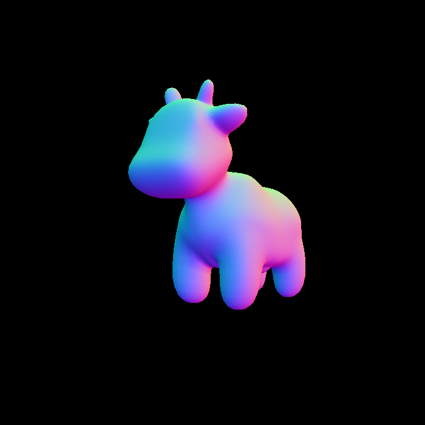
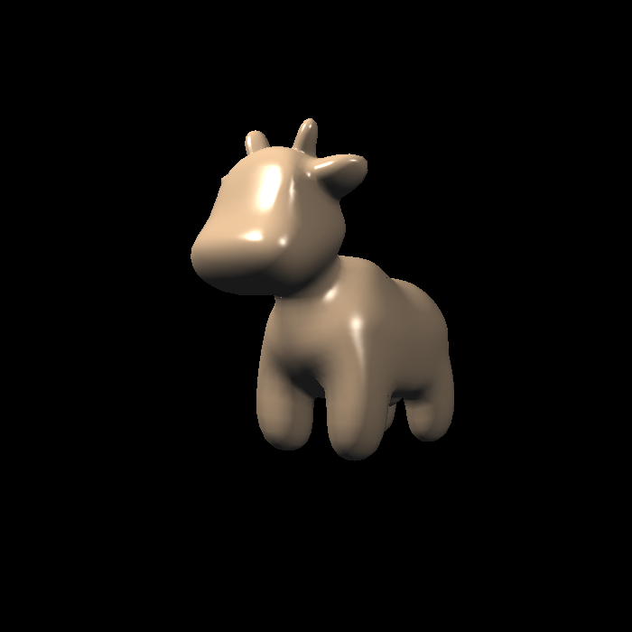
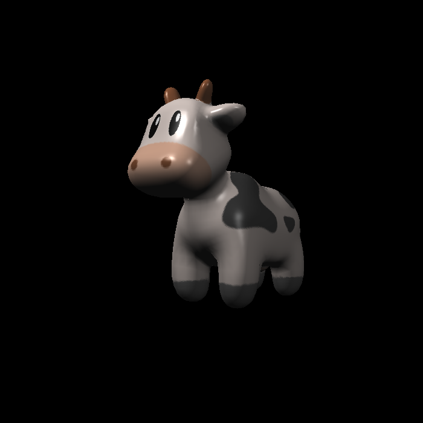
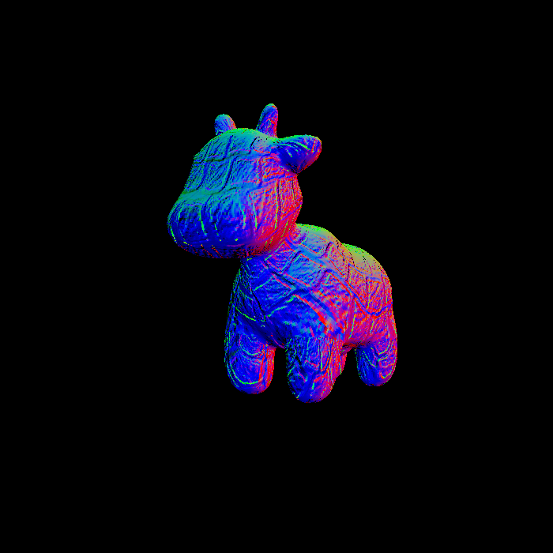
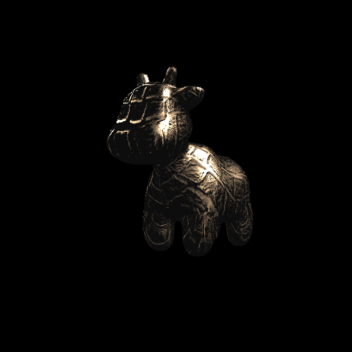

# GAMES101 Assignment 3: 渲染管线与着色模型 (学习快照)

这是一份关于 [GAMES101: 现代计算机图形学入门](https://sites.cs.ucsb.edu/~lingqi/teaching/games101.html) 作业 3 的学习记录。
本项目实现了一个基础的软件光栅化器，重点探讨了光栅化底层原理以及不同的着色计算模型。

## 项目架构 (Project Structure)

基于 GAMES101 提供的基础框架，本项目的核心逻辑分布如下：

*   **`src/main.cpp`**: 渲染主循环，配置相机、视口，加载模型并分配特定的片元着色器（如 Blinn-Phong, Texture, Bump, Displacement）。
*   **`src/rasterizer.cpp`**: 软光栅化器的核心实现。包括三角形的三维变换、深度测试（Z-Buffer），以及基于重心坐标（Barycentric Coordinates）的属性（颜色、法线、纹理坐标等）插值与透视校正。
*   **`include/Shader.hpp`**: 包含了着色器上下文以及片元着色器（Fragment Shader）载荷（Payload）的定义，是实现各种光照模型的数据传递核心。
*   **`src/Texture.cpp` & `include/Texture.hpp`**: 纹理采样逻辑的实现（如双线性插值 Bilinear Interpolation 等）。
*   **`models/`**: 包含测试渲染用的 3D 资产（如 spot, bunny, Crate 等）。

## 🎯 学习重点与 AI 辅助开发声明

作为一名致力于 **技术美术 (Technical Artist)** 路线的学习者，我在本阶段的核心诉求是**吃透图形学底层的数学推导与物理原理**。

为此，我采用了现代化的学习与开发工作流：
1.  **死磕原理**：我将绝大部分时间投入在理解渲染管线运作，以及各种图形学原理和方法的理解上，如MVP矩阵，重心坐标插值，Bling-Phong光照，texture mapping，mipmap等等。
2.  **AI 辅助工程化**：在彻底理解底层物理数学原理，后，本作业框架中的具体 C++ 语法补全、大量样板代码撰写及结构化注释，主要是通过 AI 辅助生成。
3.  **快照**：本项目是图形学学习过程中的一个快照。

## 📝 深度学习笔记与探讨 (Expectation Management)

在这个高强度推进的学习过程中，我将部分核心的阶段性梳理归纳为了公开笔记：

*   👉 **[知乎笔记：从 GAMES101 作业 3 深入理解光栅化与着色（待填入链接）](#)**

**💡 关于那些“未文档化”的思考：**

由于学习节奏紧凑，我并未将脑海中所有的底层直觉和灵感都完美地整理为纸质或电子文档。
因此，我非常乐意并在未来的面试或技术交流中，通过白板推导、草图绘制或口头交流的方式，与您深入分享这些并未写进 README 和公开笔记的深层思维过程与底层技术细节。

## 🚀 构建与运行 (Build & Run)

### 🛠 前置依赖库 (Dependencies)
*   **Eigen3**: 图形学核心的矩阵与向量数学运算库。
*   **OpenCV**: 用于图像/纹理的读取操作，以及最终光栅化结果图像的输出与保存。
*(请确保已在本地环境中正确配置这两个库的路径，以保证 CMake 能够顺利 FindPackage。)*

### 🔨 编译构建
本项目使用 CMake 构建（当前环境为 Windows）：

```bash
mkdir build
cd build
cmake ..
cmake --build .
```

###  运行说明 
程序必须在项目根目录下执行。如果在 `build` 文件夹内部直接运行，会导致找不到模型和贴图文件！

## 🖼 渲染结果 (Rendering Gallery)

这里展示了通过软光栅化器实现的不同着色效果。

<table align="center">
  <tr>
    <td align="center"><br/><b>Normal Shading</b></td>
    <td align="center"><br/><b>Flat Shading</b></td>
  </tr>
  <tr>
    <td align="center"><br/><b>Blinn-Phong Shading</b></td>
    <td align="center"><br/><b>Texture Mapping</b></td>
  </tr>
  <tr>
    <td align="center"><br/><b>Bump Mapping</b></td>
    <td align="center"><br/><b>Displacement Mapping</b></td>
  </tr>
</table>


